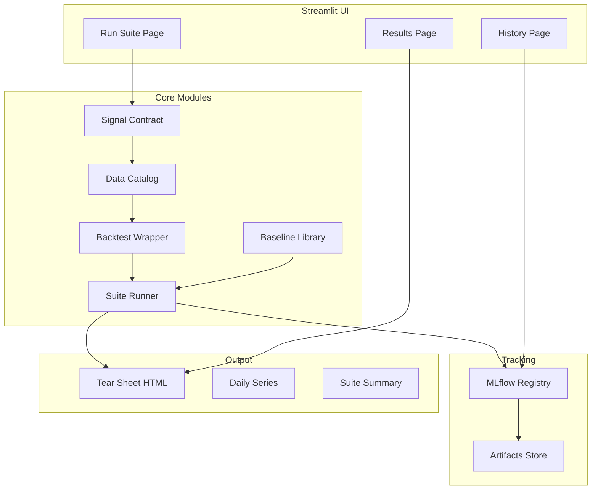

# Backtest PoC Infrastructure Implementation Plan

> **Code Style:** All code should be as simple, concise, and intuitive as possible. Prefer clarity over cleverness. Minimize abstractions unless they provide clear value.

## Architecture Overview




---

## Project Structure

```
ea_research_infrastructure/
├── backtest_engine.py          # Existing (keep as-is initially)
├── poc/
│   ├── __init__.py
│   ├── contract/
│   │   ├── __init__.py
│   │   ├── schema.py           # Signal schema + validation
│   │   └── align.py            # Date alignment functions
│   ├── data/
│   │   ├── __init__.py
│   │   ├── catalog.py          # DataCatalog class
│   │   └── manifest.py         # Snapshot manifest handling
│   ├── engine/
│   │   ├── __init__.py
│   │   ├── wrapper.py          # Canonical backtest wrapper
│   │   └── result.py           # BacktestResult dataclass
│   ├── baselines/
│   │   ├── __init__.py
│   │   └── library.py          # Baseline signal generators
│   ├── suite/
│   │   ├── __init__.py
│   │   ├── runner.py           # Suite runner (matrix of configs)
│   │   └── config.py           # Suite configuration presets
│   ├── tracking/
│   │   ├── __init__.py
│   │   └── mlflow_logger.py    # MLflow integration
│   ├── reporting/
│   │   ├── __init__.py
│   │   ├── tearsheet.py        # Tear sheet generator
│   │   ├── verdict.py          # Traffic light verdict logic
│   │   └── templates/
│   │       └── tearsheet.html  # Jinja2 template
│   └── ui/
│       └── app.py              # Streamlit application
├── snapshots/                   # Data snapshots (gitignored)
│   └── 2026-02-05-US-v1/
│       ├── manifest.json
│       ├── ret.parquet
│       ├── risk.parquet
│       └── trading_date.parquet
├── artifacts/                   # MLflow artifacts (gitignored)
├── requirements.txt
└── tests/
    └── ...
```

---

## Module 1: Signal Contract

**Purpose:** Standardize signal input format across all users/regions.

**File:** `poc/contract/schema.py`

```python
REQUIRED_COLUMNS = ['security_id', 'date_sig', 'date_avail', 'signal']
OPTIONAL_COLUMNS = ['avail_hour', 'region', 'universe', 'signal_name', 'version']

def validate_signal_df(df: pd.DataFrame) -> ValidationResult:
    """Check schema, dtypes, duplicates, missingness, lookahead."""
    
def align_dates(df: pd.DataFrame, datefile: pd.DataFrame, config: dict) -> pd.DataFrame:
    """Map to date_ret/date_openret without lookahead. Wraps existing gen_date_trading()."""
```

**Key validations:**

- Required columns present with correct dtypes
- No duplicate (security_id, date_sig) pairs
- No future-dated signals (date_avail >= date_sig)
- Signal values are numeric, finite

---

## Module 2: Data Catalog + Snapshots

**Purpose:** Safe, reproducible data access with versioned snapshots.

**File:** `poc/data/catalog.py`

```python
@dataclass
class DataCatalog:
    snapshot_id: str
    region: str
    
    def get_retfile(self) -> pd.DataFrame: ...
    def get_otherfile(self) -> pd.DataFrame: ...
    def get_datefile(self) -> pd.DataFrame: ...
    def get_manifest(self) -> dict: ...
```

**Manifest format (`manifest.json`):**

```json
{
  "snapshot_id": "2026-02-05-US-v1",
  "created_at": "2026-02-05T10:00:00Z",
  "region": "US",
  "source_hash": "abc123",
  "files": {
    "ret": {"rows": 5000000, "date_range": ["2010-01-01", "2026-01-31"]},
    "risk": {"rows": 5000000, "columns": ["security_id", "date", ...]},
    "trading_date": {"rows": 4000}
  }
}
```

**Initial snapshot creation:** Convert existing `data/*.parquet` and `data/*.pkl` files to the new snapshot format (see [Demo Dataset Preparation](#demo-dataset-preparation) section).

---

## Module 3: Canonical Backtest Wrapper

**Purpose:** Stable API wrapping existing `Backtest` class.

**File:** `poc/engine/wrapper.py`

```python
@dataclass
class BacktestResult:
    summary_table: pd.DataFrame      # Overall + slices stats
    daily_series: pd.DataFrame       # Daily pnl, cumret, drawdown, turnover
    fractile_analysis: pd.DataFrame  # Monotonicity check
    diagnostics: dict                # Coverage, missingness, correlations
    config: dict                     # Full config used
    
def run_backtest(
    signal_df: pd.DataFrame,
    config: BacktestConfig,
    catalog: DataCatalog
) -> BacktestResult:
    """
    1. Validate signal via contract
    2. Align dates
    3. Instantiate Backtest class
    4. Call gen_result()
    5. Package into BacktestResult
    """
```

**Config dataclass:**

```python
@dataclass
class BacktestConfig:
    lag: int = 0
    residualize: str = 'off'      # 'off', 'industry', 'factor', 'all'
    tc_model: str = 'naive'
    weight: str = 'equal'
    fractile: tuple = (10, 90)
    from_open: bool = False
    mincos: int = 10
```

---

## Module 4: Baseline Library

**Purpose:** Standard comparison signals for every evaluation.

**File:** `poc/baselines/library.py`

```python
def generate_reversal_signal(catalog: DataCatalog, lookback: int = 5) -> pd.DataFrame:
    """Short-term reversal: -1 * past N-day return"""

def generate_momentum_signal(catalog: DataCatalog, lookback: int = 252, skip: int = 21) -> pd.DataFrame:
    """12-1 momentum: past 12m return excluding last 1m"""

def generate_value_signal(catalog: DataCatalog) -> pd.DataFrame:
    """Value signal from otherfile 'value' factor"""

BASELINE_REGISTRY = {
    'reversal_5d': generate_reversal_signal,
    'momentum_12_1': generate_momentum_signal,
    'value': generate_value_signal,
}
```

Each baseline returns a DataFrame in signal contract format.

---

## Module 5: Suite Runner

**Purpose:** One-button execution of config matrix.

**File:** `poc/suite/runner.py`

```python
STANDARD_SUITE = {
    'lags': [0, 1, 2],
    'residualize': ['off', 'industry'],
    'tc_model': ['naive'],
    'slices': ['overall', 'year', 'cap'],
}
# Total: 3 lags x 2 resid = 6 backtests per signal

def run_suite(
    signal_df: pd.DataFrame,
    catalog: DataCatalog,
    suite_config: dict = STANDARD_SUITE,
    include_baselines: bool = True,
    n_jobs: int = -1
) -> SuiteResult:
    """
    1. Generate config matrix
    2. Run backtests in parallel (joblib)
    3. Run baselines
    4. Compute correlations (signal + pnl)
    5. Package results
    """

@dataclass
class SuiteResult:
    signal_results: Dict[str, BacktestResult]  # keyed by config hash
    baseline_results: Dict[str, BacktestResult]
    suite_summary: pd.DataFrame
    correlations: pd.DataFrame  # Signal and PnL correlations to baselines
```

---

## Module 6: MLflow Tracking

**Purpose:** Reproducible run history with full context.

**File:** `poc/tracking/mlflow_logger.py`

```python
def log_suite_run(
    suite_result: SuiteResult,
    signal_name: str,
    author: str,
    catalog: DataCatalog,
    tearsheet_path: Path
) -> str:  # returns run_id
    """
    Tags: signal_name, author, region, git_sha, data_snapshot_id, engine_version
    Params: full suite config
    Metrics: Sharpe, ann_ret, maxDD, turnover, coverage per variant
    Artifacts: tearsheet HTML, daily pnl parquet, suite summary CSV, plots
    """
```

**MLflow experiment structure:**

```
Experiment: backtest-poc
├── Run: signal_xyz_2026-02-05_10:30
│   ├── Tags: {signal_name, snapshot_id, git_sha, ...}
│   ├── Params: {lag, residualize, tc_model, ...}
│   ├── Metrics: {sharpe_lag0_residoff, sharpe_lag1_residon, ...}
│   └── Artifacts: tearsheet.html, daily_pnl.parquet, plots/
```

---

## Module 7: Tear Sheet Generator

**Purpose:** Standardized HTML report with verdict.

**File:** `poc/reporting/tearsheet.py`

**Sections:**

- **A. Headline Results:** Best variant, variant comparison table, gross vs net
- **B. Robustness:** Sharpe by year, by cap bucket
- **C. Capacity:** Turnover, avg ADV/mcap of holdings, cap-bucket performance
- **D. Uniqueness:** Signal correlation to baselines, PnL correlation to baselines
- **E. Verdict Panel:** Traffic light (Green/Yellow/Red) with bullet reasons

**Verdict logic (`poc/reporting/verdict.py`):**

```python
def compute_verdict(suite_result: SuiteResult) -> Verdict:
    """
    Green: Sharpe > 1.0, survives lag+resid, low baseline correlation
    Yellow: Sharpe 0.5-1.0, OR high turnover, OR small-cap concentrated
    Red: Sharpe < 0.5, OR fails with lag, OR baseline clone
    """
```

---

## Module 8: Streamlit UI

**Purpose:** Simple launcher + viewer.

**File:** `poc/ui/app.py`

**Pages:**

1. **Run Suite:** Upload signal (parquet/csv) or select from registry, choose preset, click Run
2. **Results:** Suite summary table, cumret/drawdown plots, links to tearsheet + MLflow
3. **History:** Table of past runs, filter by signal/date/author, compare 2 runs

**Job execution pattern:**

- Spawn subprocess on "Run" to avoid blocking UI
- Write status to `runs.sqlite` or poll MLflow
- Streamlit polls every few seconds

---

## Performance Optimizations (Step 9)

Apply these to `backtest_engine.py` only if needed for responsiveness:

1. **Vectorize ranking:** Replace `groupby().transform(lambda x: x.rank())` with `pd.Series.rank()` on sorted groups
2. **Turnover rewrite:** Avoid outer-merge; use pivot + fillna + diff approach
3. **Fast residualization:** Replace statsmodels OLS with numpy least-squares + industry demeaning
4. **Fix temp mutation:** Don't shrink `temp` DataFrame across byvar iterations in `gen_result()`
5. **Dtype optimization:** Cast `cap` to `category`, `position` to `int8`

---

## Dependencies

```
# requirements.txt
pandas>=2.0
numpy>=1.24
pyarrow>=14.0
mlflow>=2.10
streamlit>=1.30
joblib>=1.3
jinja2>=3.1
plotly>=5.18
statsmodels>=0.14
yfinance>=0.2
```

---

## Demo Dataset Preparation

### Source Data

Files in `data/` (gitignored):


| File                 | Size   | Content          |
| -------------------- | ------ | ---------------- |
| `ret.parquet`        | 1.9 GB | Daily returns    |
| `risk.parquet`       | 2.5 GB | Risk factors     |
| `descriptor.parquet` | 1.8 GB | Universe flags   |
| `trading_date.pkl`   | 188 KB | Trading calendar |
| `signal_sample.pkl`  | 332 MB | Sample signal    |


### Create Snapshot from Existing Data

**File:** `poc/data/create_snapshot.py`

```python
def create_snapshot_from_existing(source_dir='data', snapshot_id=None, output_dir='snapshots'):
    """Copy data/ files into versioned snapshot with manifest."""
    source = Path(source_dir)
    snapshot_id = snapshot_id or f"{datetime.now().strftime('%Y-%m-%d')}-US-v1"
    snapshot_path = Path(output_dir) / snapshot_id
    snapshot_path.mkdir(parents=True, exist_ok=True)
    
    ret_df = pd.read_parquet(source / 'ret.parquet')
    risk_df = pd.read_parquet(source / 'risk.parquet')
    datefile = pd.read_pickle(source / 'trading_date.pkl')
    
    ret_df.to_parquet(snapshot_path / 'ret.parquet', index=False)
    risk_df.to_parquet(snapshot_path / 'risk.parquet', index=False)
    datefile.to_parquet(snapshot_path / 'trading_date.parquet', index=False)
    
    manifest = {
        'snapshot_id': snapshot_id,
        'created_at': datetime.now().isoformat(),
        'files': {
            'ret': {'rows': len(ret_df), 'securities': ret_df['security_id'].nunique()},
            'risk': {'rows': len(risk_df)},
            'trading_date': {'rows': len(datefile)}
        }
    }
    json.dump(manifest, open(snapshot_path / 'manifest.json', 'w'), indent=2)
    return snapshot_path


def create_lightweight_snapshot(source_dir='data', n_securities=100, start_date='2020-01-01'):
    """Create smaller snapshot filtered by top N securities and date range."""
    ret_df = pd.read_parquet(Path(source_dir) / 'ret.parquet')
    ret_df = ret_df[ret_df['date'] >= start_date]
    
    top_securities = ret_df.groupby('security_id')['adv'].median().nlargest(n_securities).index
    ret_df = ret_df[ret_df['security_id'].isin(top_securities)]
    # ... same pattern for risk_df, datefile
```

### Baseline Signal Generation

**File:** `poc/baselines/library.py`

```python
def generate_reversal_signal(catalog: DataCatalog, lookback: int = 5) -> pd.DataFrame:
    """Short-term reversal: -1 * past N-day return."""
    ret = catalog.get_retfile().sort_values(['security_id', 'date'])
    ret['signal'] = -ret.groupby('security_id')['ret'].transform(
        lambda x: (1 + x).rolling(lookback).apply(lambda y: y.prod() - 1, raw=True)
    )
    return ret[['security_id', 'date', 'signal']].rename(columns={'date': 'date_sig'}).dropna()


def generate_momentum_signal(catalog: DataCatalog, lookback=252, skip=21) -> pd.DataFrame:
    """12-1 momentum: past 12m return excluding last 1m."""
    ret = catalog.get_retfile().sort_values(['security_id', 'date'])
    rolling_ret = lambda x, n: (1 + x).rolling(n).apply(lambda y: y.prod() - 1, raw=True)
    ret['signal'] = ret.groupby('security_id')['ret'].transform(rolling_ret, lookback) \
                  - ret.groupby('security_id')['ret'].transform(rolling_ret, skip)
    return ret[['security_id', 'date', 'signal']].rename(columns={'date': 'date_sig'}).dropna()


def generate_value_signal(catalog: DataCatalog) -> pd.DataFrame:
    """Value signal from risk file."""
    return catalog.get_otherfile()[['security_id', 'date', 'value']].rename(
        columns={'date': 'date_sig', 'value': 'signal'}
    )

BASELINE_REGISTRY = {
    'reversal_5d': generate_reversal_signal,
    'momentum_12_1': generate_momentum_signal,
    'value': generate_value_signal,
}
```

### Quick Start

```bash
# Create lightweight snapshot
python -c "from poc.data.create_snapshot import create_lightweight_snapshot; create_lightweight_snapshot()"

# Verify
ls snapshots/ && cat snapshots/*/manifest.json
```

---

## Testing Strategy

- Unit tests for contract validation
- Unit tests for baseline signal generation
- Integration test: full suite run on sample signal
- Snapshot test: tear sheet output consistency

